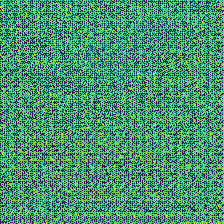
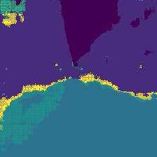
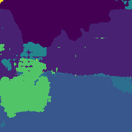
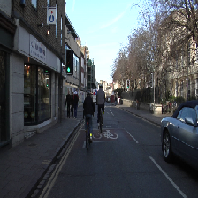
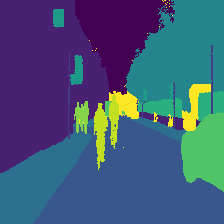
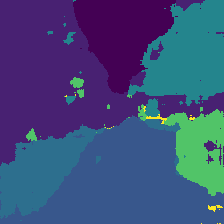

Using **Transfer Learning** for training. I implement FCN-8s using VGG16. 
FCN is composed of two parts. VGG16 makes heatmap, and it is not trained in my code because i think there should be criteria. VGG16 is already trained well, so i think that i don't need to train it. Only FCN's upsample section is trained in my code. 


# Architecture  
I implement FCN-8s in paper. The architecture of it is equal to the paper's. I seperate "8x stride" to "2x stride" 3 times for making CNN more deeper. There is a result that DNN has more higher performance when it is more deeper.  


# Dataset  
dataset1 is the dataset that i use, and i get it from: https://github.com/divamgupta/image-segmentation-keras. 


# Problem 
 1) VGG16's Conv layer's output 1/2 size of input size. What if input is odd? Under decimal point's value is rounded down. It makes dimension incorrect when VGG16's pool3,4,5's results are concatenated. So i should transform train image size to specific size which should be multiples of 2^5 (5 is conv layer's count) 
 
 2) My CNN classify only 2 class when i use CrossEntropy Loss function, but there are 11 class. So i should use another loss function that deal with predicted output independently. So i use my custom loss function that penalizes more to incorrect for preventing converging to specific class.   
```python 
true_log_pred = torch.log(pred) # "pred" is output of FCN.  
false_log_pred = torch.log(torch.ones_like(pred) - pred) # by using BCEWithLogitsLoss's principle.
loss1 = -(y * true_log_pred).mean()
loss2 = -((1.001 * torch.ones_like(y)-y) * (false_log_pred)).mean() # 1.001 is for preventing log(0).
loss = loss1 + 2 * loss2 # (1,2) is the weight for penalizing convergence to specific class which is "false". 
```


# Train Result
 I train my model by using hyper parameters that paper suggest.  

* batch_size = 20
* epochs = 120
* lr = 1e-4
* momentum = 0.9
* weight_decay = 1e-5   


1. img directories save images for showing how it is trained during learning process. For example,   

epochs: 1   

  

epochs: 20   



epochs: 80   



2. ans_img directories save test images, original image, True segmentation images and predicted images. You get get that data if you run main.py For example,   
  


# Reference:  
* paper: https://arxiv.org/pdf/1411.4038.pdf   
* Uing image dataset at: https://github.com/divamgupta/image-segmentation-keras  
